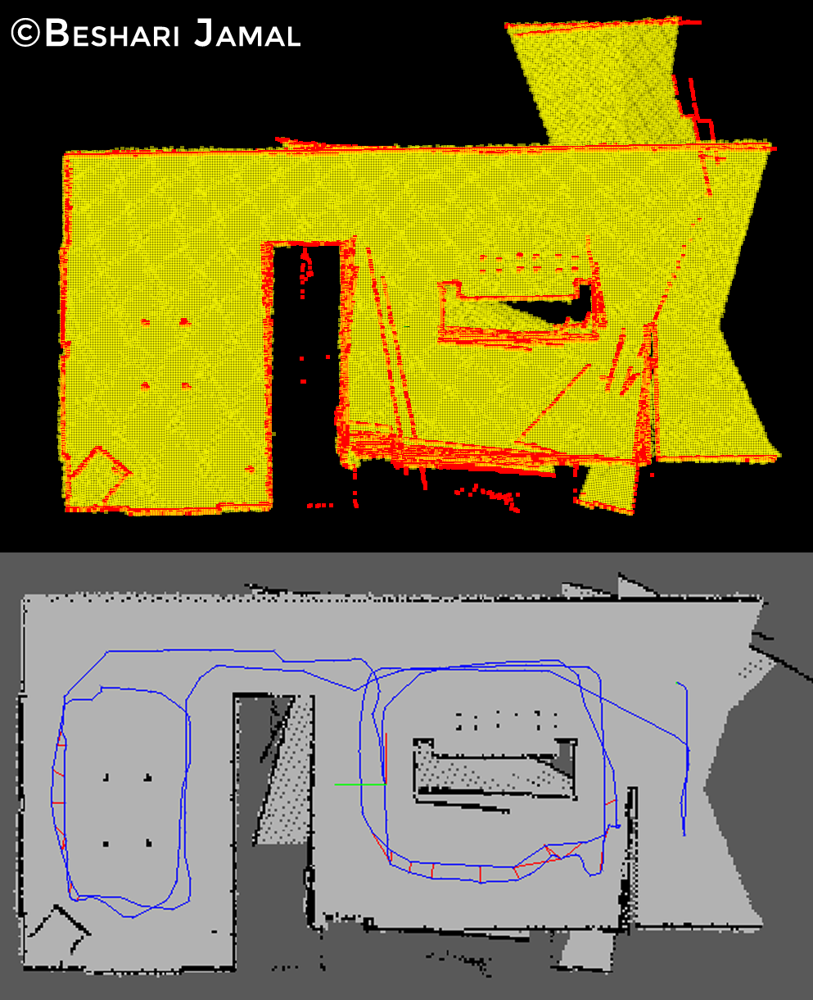
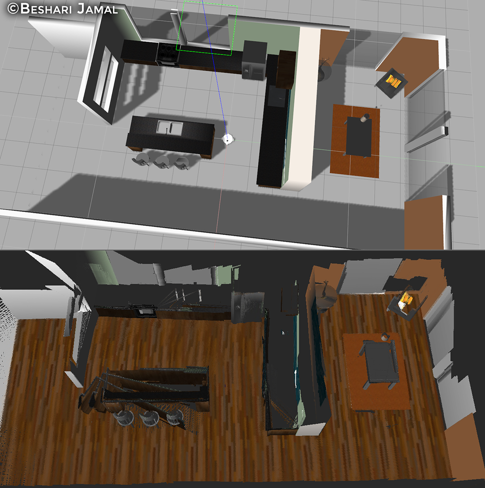
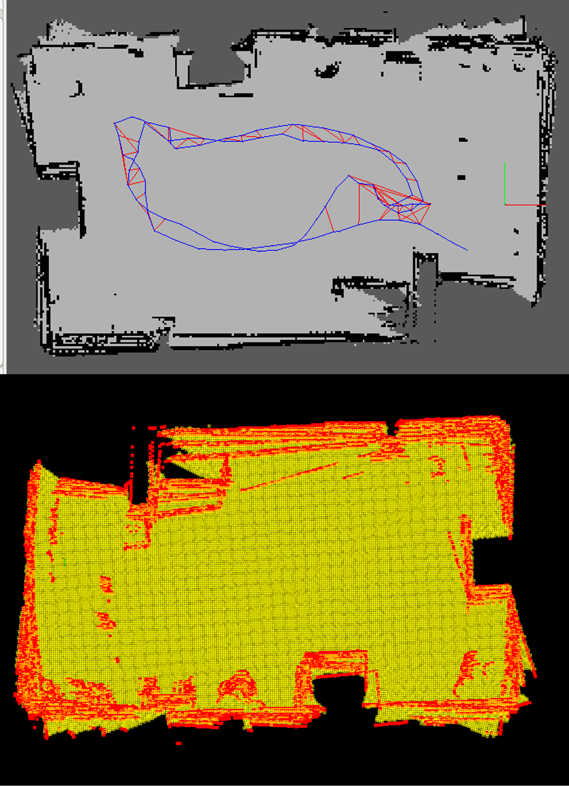
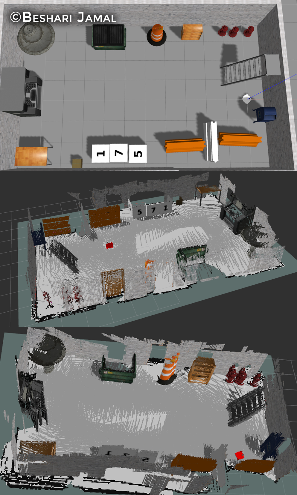

# SLAM-map-my-world
Udacity Robotics Software Engineer Nanodegree SLAM project repository.

A robot moving indoors, mapping the surroundings and localizing itself at the same time

if you have a catkin_ws folder then skip the follwoing step.
however if you do not have an active ROS workspace, you can create one by:

If you do not have an active ROS workspace, you can create one by:

```sh
mkdir -p ~/catkin_ws/src
cd ~/catkin_ws
catkin_make
source devel/setup.bash
```
Clone this repository to the `~/catkin_ws/src` folder

```sh
cd ~/catkin_ws/src
git clone rtabmap_ros
git clone https://github.com/Beshario/SLAM-map-my-world
```


setup and build RTAB-map from source using this link:

[link](https://github.com/introlab/rtabmap_ros#build-from-source)

Now install missing dependencies using rosdep install:

```sh
rosdep install -i rtabmap_ros
rosdep install -i slam_bot
```

Build the project then source the ROS environment variables:

```sh
cd ~/catkin_ws
catkin_make
source devel/setup.bash

```

Download the kitchen dining room `*.world` file with collision models (some files do not include collision models):

```sh
curl -L https://s3-us-west-1.amazonaws.com/udacity-robotics/Term+2+Resources/P3+Resources/models.tar.gz | tar zx -C ~/.gazebo/
```

source the ROS environment variables when you open any new terminal. Open three terminals and  to the `~/catkin_ws/src/slam_bot/launch` folder and run each command in one terminal:

```sh
roslaunch slam_bot world.launch world_name:=kitchen_dining.world
roslaunch slam_bot teleop.launch
roslaunch slam_bot mapping.launch
```

<p align="center"></p>
<p align="center"></p>
<p align="center"></p>
<p align="center"></p>

